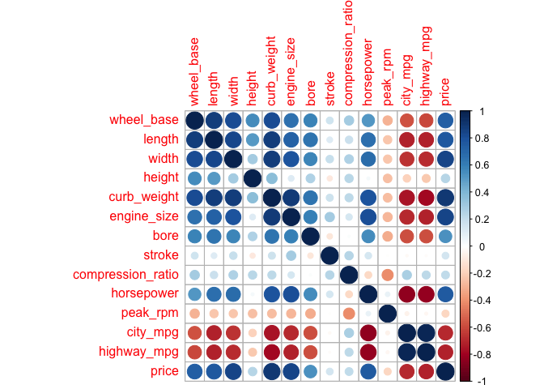
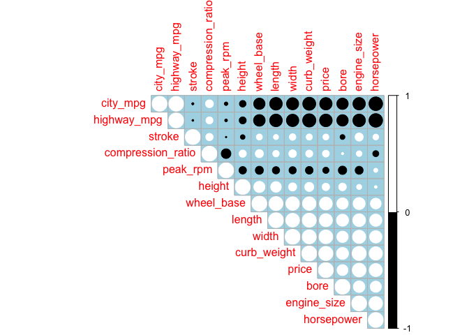
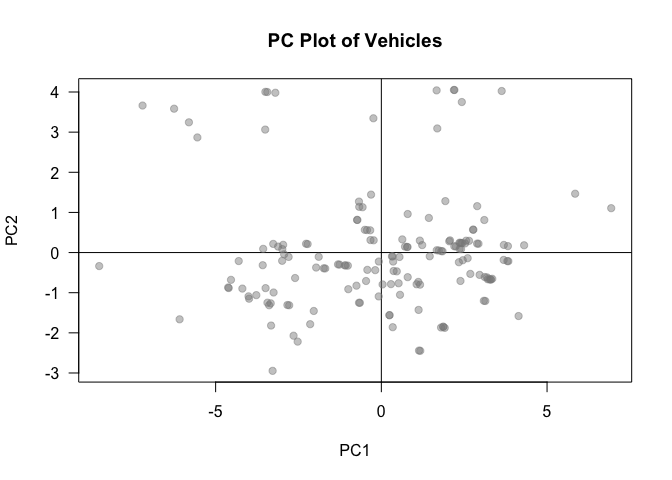
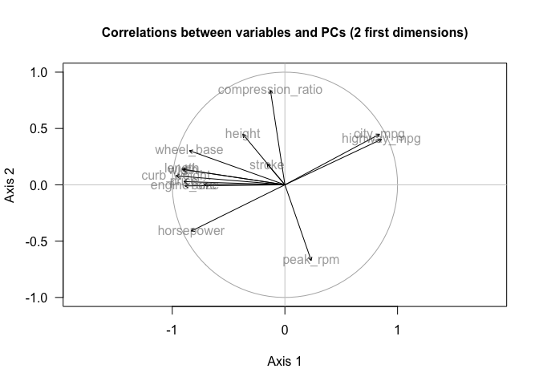
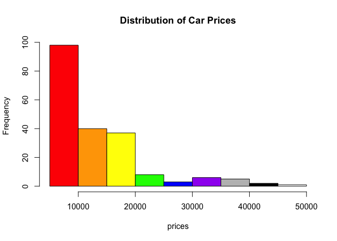
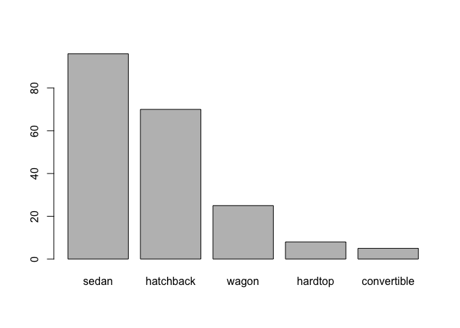
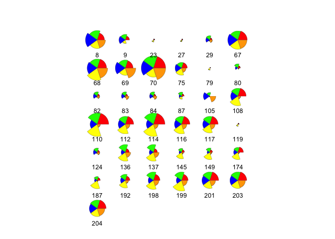

hw01-jahaan-ansari
================

R Markdown
----------

This is an R Markdown document. Markdown is a simple formatting syntax for authoring HTML, PDF, and MS Word documents. For more details on using R Markdown see <http://rmarkdown.rstudio.com>.

When you click the **Knit** button a document will be generated that includes both content as well as the output of any embedded R code chunks within the document. You can embed an R code chunk like this:

``` r
library(readr)
#Part 2 - Data Import
col_names <- c(
    "symboling",
    "normalized_losses",
    "make",
    "fuel_type",
    "aspiration",
    "num_of_doors",
    "body_style",
    "drive_wheels",
    "engine_location",
    "wheel_base",
    "length",
    "width",
    "height",
    "curb_weight",
    "engine_type",
    "num_of_cylinders",
    "engine_size",
    "fuel_system",
    "bore",
    "stroke",
    "compression_ratio",
    "horsepower",
    "peak_rpm",
    "city_mpg",
    "highway_mpg",
    "price"
)

col_types <- c(
    "integer",
    "real",
    "character",
    "character",
    "character",
    "character",
    "character",
    "character",
    "character",
    "real",
    "real",
    "real",
    "real",
    "integer",
    "character",
    "character",
    "integer",
    "character",
    "real",
    "real",
    "real",
    "integer",
    "integer",
    "integer",
    "integer",
    "integer"
)

data <- read.csv(
    'imports-85.data',
    col.names = col_names,
    colClasses = col_types,
    na.strings=c("?")
)

str(data)
```

    ## 'data.frame':    204 obs. of  26 variables:
    ##  $ symboling        : int  3 1 2 2 2 1 1 1 0 2 ...
    ##  $ normalized_losses: num  NA NA 164 164 NA 158 NA 158 NA 192 ...
    ##  $ make             : chr  "alfa-romero" "alfa-romero" "audi" "audi" ...
    ##  $ fuel_type        : chr  "gas" "gas" "gas" "gas" ...
    ##  $ aspiration       : chr  "std" "std" "std" "std" ...
    ##  $ num_of_doors     : chr  "two" "two" "four" "four" ...
    ##  $ body_style       : chr  "convertible" "hatchback" "sedan" "sedan" ...
    ##  $ drive_wheels     : chr  "rwd" "rwd" "fwd" "4wd" ...
    ##  $ engine_location  : chr  "front" "front" "front" "front" ...
    ##  $ wheel_base       : num  88.6 94.5 99.8 99.4 99.8 ...
    ##  $ length           : num  169 171 177 177 177 ...
    ##  $ width            : num  64.1 65.5 66.2 66.4 66.3 71.4 71.4 71.4 67.9 64.8 ...
    ##  $ height           : num  48.8 52.4 54.3 54.3 53.1 55.7 55.7 55.9 52 54.3 ...
    ##  $ curb_weight      : int  2548 2823 2337 2824 2507 2844 2954 3086 3053 2395 ...
    ##  $ engine_type      : chr  "dohc" "ohcv" "ohc" "ohc" ...
    ##  $ num_of_cylinders : chr  "four" "six" "four" "five" ...
    ##  $ engine_size      : int  130 152 109 136 136 136 136 131 131 108 ...
    ##  $ fuel_system      : chr  "mpfi" "mpfi" "mpfi" "mpfi" ...
    ##  $ bore             : num  3.47 2.68 3.19 3.19 3.19 3.19 3.19 3.13 3.13 3.5 ...
    ##  $ stroke           : num  2.68 3.47 3.4 3.4 3.4 3.4 3.4 3.4 3.4 2.8 ...
    ##  $ compression_ratio: num  9 9 10 8 8.5 8.5 8.5 8.3 7 8.8 ...
    ##  $ horsepower       : int  111 154 102 115 110 110 110 140 160 101 ...
    ##  $ peak_rpm         : int  5000 5000 5500 5500 5500 5500 5500 5500 5500 5800 ...
    ##  $ city_mpg         : int  21 19 24 18 19 19 19 17 16 23 ...
    ##  $ highway_mpg      : int  27 26 30 22 25 25 25 20 22 29 ...
    ##  $ price            : int  16500 16500 13950 17450 15250 17710 18920 23875 NA 16430 ...

``` r
col_type_list = as.list(c(col_integer(),col_double(),col_character(),col_character(), col_character(), col_character(), col_character(), col_character(), col_character(), col_double(), col_double(), col_double(), col_double(), col_integer(), col_character(), col_character(), col_integer(), col_character(), col_double(), col_double(), col_double(), col_integer(), col_integer(), col_integer(), col_integer(), col_integer()))

readr_data <- read_csv('imports-85.data', col_names = col_names, col_types = col_type_list)
str(readr_data)
```

    ## Classes 'tbl_df', 'tbl' and 'data.frame':    205 obs. of  26 variables:
    ##  $ symboling        : int  3 3 1 2 2 2 1 1 1 0 ...
    ##  $ normalized_losses: chr  "?" "?" "?" "164" ...
    ##  $ make             : chr  "alfa-romero" "alfa-romero" "alfa-romero" "audi" ...
    ##  $ fuel_type        : chr  "gas" "gas" "gas" "gas" ...
    ##  $ aspiration       : chr  "std" "std" "std" "std" ...
    ##  $ num_of_doors     : chr  "two" "two" "two" "four" ...
    ##  $ body_style       : chr  "convertible" "convertible" "hatchback" "sedan" ...
    ##  $ drive_wheels     : chr  "rwd" "rwd" "rwd" "fwd" ...
    ##  $ engine_location  : chr  "front" "front" "front" "front" ...
    ##  $ wheel_base       : num  88.6 88.6 94.5 99.8 99.4 ...
    ##  $ length           : num  169 169 171 177 177 ...
    ##  $ width            : num  64.1 64.1 65.5 66.2 66.4 66.3 71.4 71.4 71.4 67.9 ...
    ##  $ height           : num  48.8 48.8 52.4 54.3 54.3 53.1 55.7 55.7 55.9 52 ...
    ##  $ curb_weight      : int  2548 2548 2823 2337 2824 2507 2844 2954 3086 3053 ...
    ##  $ engine_type      : chr  "dohc" "dohc" "ohcv" "ohc" ...
    ##  $ num_of_cylinders : chr  "four" "four" "six" "four" ...
    ##  $ engine_size      : int  130 130 152 109 136 136 136 136 131 131 ...
    ##  $ fuel_system      : chr  "mpfi" "mpfi" "mpfi" "mpfi" ...
    ##  $ bore             : chr  "3.47" "3.47" "2.68" "3.19" ...
    ##  $ stroke           : chr  "2.68" "2.68" "3.47" "3.40" ...
    ##  $ compression_ratio: num  9 9 9 10 8 8.5 8.5 8.5 8.3 7 ...
    ##  $ horsepower       : chr  "111" "111" "154" "102" ...
    ##  $ peak_rpm         : chr  "5000" "5000" "5000" "5500" ...
    ##  $ city_mpg         : int  21 21 19 24 18 19 19 19 17 16 ...
    ##  $ highway_mpg      : int  27 27 26 30 22 25 25 25 20 22 ...
    ##  $ price            : chr  "13495" "16500" "16500" "13950" ...
    ##  - attr(*, "spec")=List of 2
    ##   ..$ cols   :List of 26
    ##   .. ..$ symboling        : list()
    ##   .. .. ..- attr(*, "class")= chr  "collector_integer" "collector"
    ##   .. ..$ normalized_losses: list()
    ##   .. .. ..- attr(*, "class")= chr  "collector_character" "collector"
    ##   .. ..$ make             : list()
    ##   .. .. ..- attr(*, "class")= chr  "collector_character" "collector"
    ##   .. ..$ fuel_type        : list()
    ##   .. .. ..- attr(*, "class")= chr  "collector_character" "collector"
    ##   .. ..$ aspiration       : list()
    ##   .. .. ..- attr(*, "class")= chr  "collector_character" "collector"
    ##   .. ..$ num_of_doors     : list()
    ##   .. .. ..- attr(*, "class")= chr  "collector_character" "collector"
    ##   .. ..$ body_style       : list()
    ##   .. .. ..- attr(*, "class")= chr  "collector_character" "collector"
    ##   .. ..$ drive_wheels     : list()
    ##   .. .. ..- attr(*, "class")= chr  "collector_character" "collector"
    ##   .. ..$ engine_location  : list()
    ##   .. .. ..- attr(*, "class")= chr  "collector_character" "collector"
    ##   .. ..$ wheel_base       : list()
    ##   .. .. ..- attr(*, "class")= chr  "collector_double" "collector"
    ##   .. ..$ length           : list()
    ##   .. .. ..- attr(*, "class")= chr  "collector_double" "collector"
    ##   .. ..$ width            : list()
    ##   .. .. ..- attr(*, "class")= chr  "collector_double" "collector"
    ##   .. ..$ height           : list()
    ##   .. .. ..- attr(*, "class")= chr  "collector_double" "collector"
    ##   .. ..$ curb_weight      : list()
    ##   .. .. ..- attr(*, "class")= chr  "collector_integer" "collector"
    ##   .. ..$ engine_type      : list()
    ##   .. .. ..- attr(*, "class")= chr  "collector_character" "collector"
    ##   .. ..$ num_of_cylinders : list()
    ##   .. .. ..- attr(*, "class")= chr  "collector_character" "collector"
    ##   .. ..$ engine_size      : list()
    ##   .. .. ..- attr(*, "class")= chr  "collector_integer" "collector"
    ##   .. ..$ fuel_system      : list()
    ##   .. .. ..- attr(*, "class")= chr  "collector_character" "collector"
    ##   .. ..$ bore             : list()
    ##   .. .. ..- attr(*, "class")= chr  "collector_character" "collector"
    ##   .. ..$ stroke           : list()
    ##   .. .. ..- attr(*, "class")= chr  "collector_character" "collector"
    ##   .. ..$ compression_ratio: list()
    ##   .. .. ..- attr(*, "class")= chr  "collector_double" "collector"
    ##   .. ..$ horsepower       : list()
    ##   .. .. ..- attr(*, "class")= chr  "collector_character" "collector"
    ##   .. ..$ peak_rpm         : list()
    ##   .. .. ..- attr(*, "class")= chr  "collector_character" "collector"
    ##   .. ..$ city_mpg         : list()
    ##   .. .. ..- attr(*, "class")= chr  "collector_integer" "collector"
    ##   .. ..$ highway_mpg      : list()
    ##   .. .. ..- attr(*, "class")= chr  "collector_integer" "collector"
    ##   .. ..$ price            : list()
    ##   .. .. ..- attr(*, "class")= chr  "collector_character" "collector"
    ##   ..$ default: list()
    ##   .. ..- attr(*, "class")= chr  "collector_guess" "collector"
    ##   ..- attr(*, "class")= chr "col_spec"

``` r
#Part 3 - Technical Questions about importing data
#a. The names of the columns become the first row of the data's values for the respective column. For numerical columns the comlumn name is preceeded by and X. (i.e. a column with the first value 77 will be called "X77")

#b. The columns will be titled "V#" where # is the column number

#c. They are converted to <chr> data types

#d. Without knowing the data types, more space needs to be allocated in order to remain flexible and store any possible type of data. By defining the data types before hand less space is necessary.

#e. When converting the dataframe to a matrix, none numeric fields are converted to NA


#Part 5
#a. $12913.19, $15838.15
gas <- data[data$fuel_type == "gas",]
mean(gas$price, na.rm = TRUE)
```

    ## [1] 12913.19

``` r
diesel <- data[data$fuel_type == "diesel",]
mean(diesel$price, na.rm = TRUE)
```

    ## [1] 15838.15

``` r
#b. jaguar
data[data$num_of_cylinders == "twelve", ]$make
```

    ## [1] "jaguar"

``` r
#c. peugot
sort(table(diesel$make), decreasing = TRUE)
```

    ## 
    ##        peugot mercedes-benz    volkswagen        toyota         mazda 
    ##             5             4             4             3             2 
    ##        nissan         volvo 
    ##             1             1

``` r
#d. NA
data[data$horsepower == max(data$horsepower, na.rm = TRUE),]$price
```

    ## [1] NA NA NA

``` r
#e. 17.0 mpg
quantile(data$city_mpg, probs = seq(0, 1, by= 0.1))
```

    ##   0%  10%  20%  30%  40%  50%  60%  70%  80%  90% 100% 
    ## 13.0 17.0 19.0 21.0 24.0 24.0 26.0 28.0 31.0 31.7 49.0

``` r
#f. 38 mpg
quantile(data$highway_mpg, probs = seq(0, 1, by= 0.1))
```

    ##   0%  10%  20%  30%  40%  50%  60%  70%  80%  90% 100% 
    ## 16.0 23.0 24.6 26.0 29.0 30.0 32.0 34.0 37.0 38.0 54.0

``` r
#g. $32250
median(data[data$city_mpg <= 17,]$price, na.rm = TRUE)
```

    ## [1] 32250

``` r
#part 6
#a. Returns NULL

#b.
  #1. Succcesful
  #2. Successful only if mpg is the first column
  #3. Successful only if mpg is the first column
  #4. Unuccessful 
  #5. Successful
  #6. Successful
  #7. Successful

#c. only 3 would always fail and that's because mpg is interpreted as a variable rather than a string. if mpg <- "mpg" then it would actually work

#d. YES: If a list or data frame or matrix is passed to ‘data.frame’ it is as if each component or column had been passed as a separate argument
# i.e. data.frame(a = I(list(1,2,3,4)))

#e. It will return a list of lists where inner lists are the column values

#f. data.frame(abc)

#part 7
nums <- sapply(data, is.numeric)
qdat <- na.omit(data[,nums])[ , -which(names(data) %in% c("symboling","normalized_losses"))]
cor_dat <- cor(qdat)
library(corrplot)
```

    ## corrplot 0.84 loaded

``` r
corrplot(cor_dat)
```



``` r
corrplot(cor_dat, type = "upper", order="hclust", col = c("black", "white"), bg = "lightblue")
```



``` r
#most positively correlated variables:
# city_mpg - highway_mpg
# wheel_base - length, width, weight, price
# length - width, weight, price
# width - weight, price
# engine_size - horse_power

#most negatively correlated variables:
# city_mpg - wheel_base, length, width, weight, price, bore, engine_size, horse_power
# highway_mpg - wheel_base, length, width, weight, price, bore, engine_size, horse_power

#Part 8
#8.1 - 79.6%
pca_prcomp <- prcomp(qdat, scale. = TRUE)
eigenvalues <- pca_prcomp$sdev^2
eigs <- eigenvalues
eigs_perc <- 100 * eigs / sum(eigs)
eigs_cum <- cumsum(eigs_perc)

eigs_df <- data.frame(
  eigenvalue = eigs,
  percentage = eigs_perc,
  'cumulative percentage' = eigs_cum
)

print(round(eigs_df, 4), print.gap = 2)
```

    ##     eigenvalue  percentage  cumulative.percentage
    ## 1       7.7717     55.5122                55.5122
    ## 2       2.0603     14.7166                70.2288
    ## 3       1.3200      9.4284                79.6572
    ## 4       0.8810      6.2926                85.9498
    ## 5       0.5636      4.0254                89.9752
    ## 6       0.3898      2.7844                92.7596
    ## 7       0.2747      1.9621                94.7217
    ## 8       0.2244      1.6030                96.3247
    ## 9       0.1478      1.0554                97.3801
    ## 10      0.1220      0.8714                98.2515
    ## 11      0.0899      0.6421                98.8936
    ## 12      0.0863      0.6163                99.5099
    ## 13      0.0460      0.3286                99.8385
    ## 14      0.0226      0.1615               100.0000

``` r
#8.2 

plot(pca_prcomp$x, type = "n", las = 1)
abline(h = 0, v = 0)
points(pca_prcomp$x[ ,1], pca_prcomp$x[ ,2], pch = 19, 
       col = "#88888877")
title(main = "PC Plot of Vehicles")
```



``` r
pca_princomp <- princomp(qdat, cor = TRUE)
scores <- pca_prcomp$x
pc_cors <- cor(qdat, scores)
# function to create a circle
circle <- function(center = c(0, 0), npoints = 100) {
  r = 1
  tt = seq(0, 2 * pi, length = npoints)
  xx = center[1] + r * cos(tt)
  yy = center[1] + r * sin(tt)
  return(data.frame(x = xx, y = yy))
}

corcir <- circle(c(0, 0), npoints = 100)

# circle of correlations
plot(pc_cors[ ,1:2], type = 'n', las = 1, xlim = c(-1, 1), ylim = c(-1, 1),
     xlab = "Axis 1", ylab = "Axis 2", asp = 1)
title("Correlations between variables and PCs (2 first dimensions)",
      cex.main = 1)
lines(corcir, col = "gray70")
abline(h = 0, v = 0, col = "gray80")
arrows(rep(0, nrow(pc_cors)), rep(0, nrow(pc_cors)), pc_cors[,1], pc_cors[,2], 
       length = 0.05)
text(pc_cors[ ,1], pc_cors[ ,2], rownames(pc_cors), col = "#55555588")
```



``` r
#The best variables are the mpg's as they are closest to the circle. Height and stroke are the worst
```

Including Plots
---------------

You can also embed plots, for example:



    ##    Min. 1st Qu.  Median    Mean 3rd Qu.    Max.    NA's 
    ##    5118    7775   10270   13206   16501   45400       4



Note that the `echo = FALSE` parameter was added to the code chunk to prevent printing of the R code that generated the plot.
